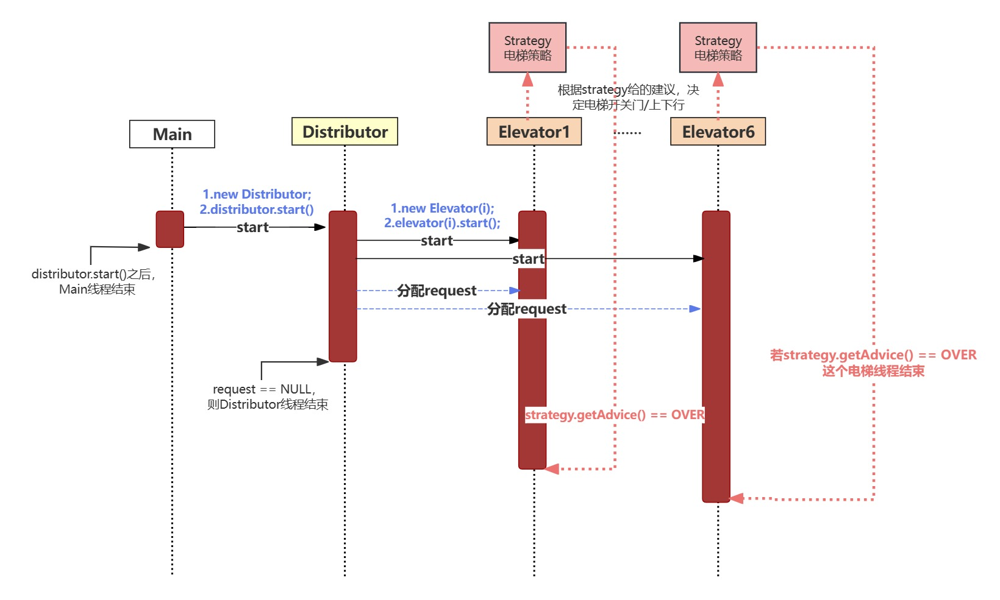
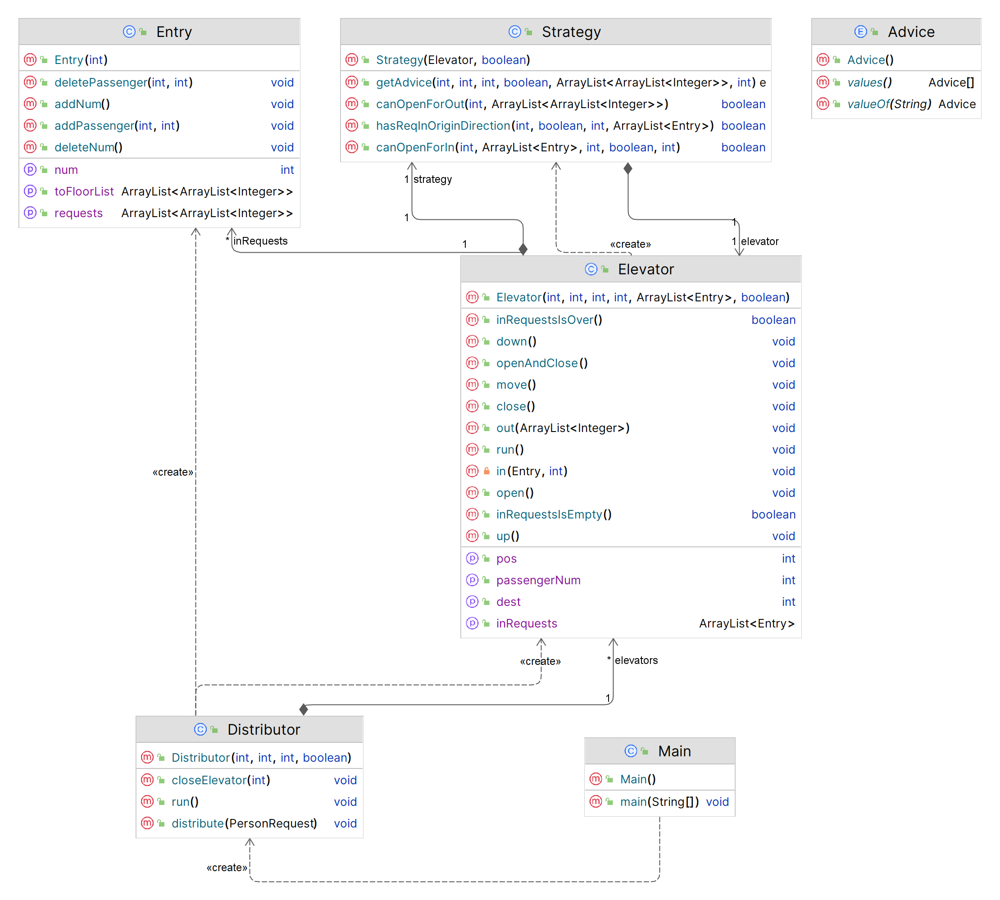
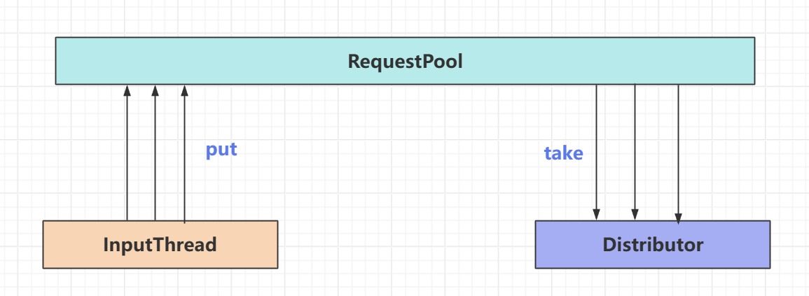
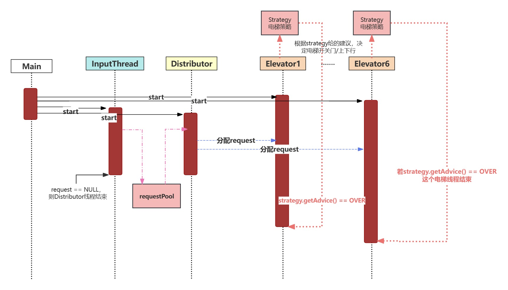

## 【BUAA-OO】M2:电梯

## 题目概述

第二单元的作业主要解决了六个电梯运送一群乘客的电梯调度与乘客分配问题。第一次作业中乘客指定电梯，第二、三次作业中乘客不指定电梯。

注：第二、三次作业的架构比较值得学习，第一次作业的架构可复用性不强，不必参考。

## Unit 1

楼座内有多部电梯，电梯可以在楼座内1-11层之间运行。系统从标准输入中读入乘客请求信息(起点层，终点楼层)，乘客请求信息中包含某部电梯编号id，然后被分配请求的电梯会经过**上下行，开关门，乘客进入/离开电梯**等动作将乘客从起点层运送到终点层。请求的输入通过课程组提供的输入接口来定时投放请求。

可以采用任何电梯运行策略，即任意时刻，系统选择上下行动，是否在某层开关门都可以自定义，只要保证在电梯系统运行时间不超过题目要求时间上限的前提下将所有的乘客送至目的地即可。

### 架构设计

随着时间的推移，不断有乘客请求输入；同时乘客请求也会被分配到各个电梯中，从而被解决。这其实就是一个**生产者-消费者**模型。遗憾的是，第一次作业设计中我没有按照这个模型来设计，而是将生产者和消费者糅合到了同一个Distributor类中，让它同时接受乘客请求request，并根据其指定电梯序号把它们分配到各个电梯的【想上梯队列inRequests】。（在第二次作业中我进行了重构，在这篇文章的第二单元处记录，比较值得参考。）

#### 总体架构

第一次架构设计中，一共有三类线程：主线程Main、分配器线程Distributor、6个电梯线程Elevator。线程时序图如下：

1.Main线程启动Distributor线程，

2.Distributor线程启动6个Elevator线程，并接受request把它们按照指定电梯序号分配给指定电梯。



UML类图如下：



#### 同步块的设置与锁的选择

Java中的【同步块】用**synchronized**标记。所有同步在一个对象上的同步块在同时只能被一个线程进入并执行操作。所有其他等待进入该同步块的线程将被阻塞，直到执行该同步块中的线程退出。【同步】实际的实现由【锁】完成。

可以把【锁】理解为一个【通行证】，java中的每个对象都有一个内置【锁】。对一段代码块【加锁】就是在限制这段代码块的执行条件，只有当这个代码块所在线程拥有了这个【加锁对象】对应的【通行证】的时候，这段加锁代码块才能顺利执行。假如有多个线程同时抢锁，那么就会有线程因为没抢到而等待；直到抢到锁的那个线程执行完了它的代码块，释放锁，等待的这一群线程又会冲上去抢锁。

同时，【加锁】方法还有一个隐藏功能：因为别的线程抢不到锁，所以保证了这段代码块一定会按顺序执行完才会进行其它步骤，而不会中间对线程间的【共享对象】进行其它操作使其发生改变。

在第一次作业中，我选择了全部**在语句块内对对象加锁**的模式。如：

````java
synchronized (inRequests) { //inRequests是【加锁对象】
    //do something
}
````

这种模式的优点是比较灵活，弊端是因为我搞不太清哪里要加哪里不用加，会加得太多导致耗时过长。

与之相对的，还有另一种加锁模式——**对类中的方法声明使用synchronized**。这一种模式在之后的作业中有所利用。

````java
public synchronized void addRequest(Person person) {
        if (person == null) {
            return;
        }
        if (!requests.containsKey(person.getFromFloor())) {
            requests.put(person.getFromFloor(), new ArrayList<>());
        }
        requests.get(person.getFromFloor()).add(person);
        requestsSum++;
        notifyAll(); 
    }
````

这样的函数方法操作，保证最多只能有一个线程调用这个方法。

### 设计中的几个关键问题

#### 一个乘客request要分配给哪个电梯？

分配给指定电梯序号的那部电梯。

#### 电梯如何管理被分配给它的那些乘客？

使用等待上梯的乘客队列inRequests、在电梯里想要出去的乘客队列outRequests来存储这些乘客。

#### 电梯调度策略？

使用了LOOK算法，具体内容可参考[这个学长的博客](https://hyggge.github.io/2022/04/29/oo/oo-di-er-dan-yuan-zong-jie/#%E8%B0%83%E5%BA%A6%E7%AD%96%E7%95%A5)，解释得特别清晰！

### bug分析

在强测中没有bug，但是在互测中被hack了1次。常见错误：

#### RTLE

互测中，我被hack的地方是REAL_TIME_LIMIT_EXCEED，意思是程序在限定的220s内并没有结束。这种情况的发生有两种可能原因：

1.存在线程没有正确退出程序，常见于elevator的结束条件设置有问题。这种问题通过在线程结束前添加print一般可以发现。

2.存在某些问题（电梯调度策略问题/在不该wait的时间多wait了/……），导致虽然结束条件没有问题，但是运行时间还是太长了。这种问题需要在测试时使用比较强悍的数据才能发现，如经典例子：在50s的时候上一堆想要坐同一个电梯的人。

````
[49.0]1-FROM-1-TO-11-BY-1
[50.0]2-FROM-2-TO-11-BY-1
[50.0]3-FROM-2-TO-10-BY-1
[50.0]4-FROM-2-TO-9-BY-1
[50.0]5-FROM-2-TO-8-BY-1
[50.0]6-FROM-1-TO-11-BY-1
[50.0]7-FROM-1-TO-10-BY-1
[50.0]8-FROM-1-TO-9-BY-1
[50.0]9-FROM-1-TO-8-BY-1
[50.0]10-FROM-1-TO-7-BY-1
[50.0]11-FROM-1-TO-6-BY-1
[50.0]12-FROM-1-TO-11-BY-1
[50.0]13-FROM-1-TO-10-BY-1
[50.0]14-FROM-1-TO-9-BY-1
[50.0]15-FROM-1-TO-8-BY-1
[50.0]16-FROM-1-TO-7-BY-1
[50.0]17-FROM-1-TO-6-BY-1
[50.0]18-FROM-1-TO-11-BY-1
[50.0]19-FROM-1-TO-10-BY-1
[50.0]20-FROM-1-TO-9-BY-1
[50.0]21-FROM-1-TO-8-BY-1
[50.0]22-FROM-1-TO-7-BY-1
[50.0]23-FROM-1-TO-6-BY-1
[50.0]24-FROM-1-TO-11-BY-1
[50.0]25-FROM-1-TO-10-BY-1
[50.0]26-FROM-1-TO-9-BY-1
[50.0]27-FROM-1-TO-8-BY-1
````

经过debug，我发现自己的问题为：move()中使用了inRequests.wait(moveTime);在move里的up()down()里又使用了elevator.sleep(moveTime)，从而导致每次move一层楼要花800ms，而不是400ms时间。

修复bug之后减少了同步代码块的控制区域，让其更精细，并修改了上面所说的错误逻辑。

## Unit 2

1.在第一次作业的基础上，第二次作业中乘客不再指定自己想要进哪部电梯。

2.在电梯移动之前，需要输出`RECEIVE-乘客id-电梯id`，表示该乘客被分配给了该电梯。

3.新增resetRequest，可以对某部电梯进行重置reset。重置时间为1.2秒，resetRequest中会包括重置后的满载人数capacity、重置后移动一层的时间moveTime。重置期间，该电梯中不能有人，不能输出RECEIVE，不能移动。

### 架构设计：生产者-消费者模型

生产者-消费者模型，说白了就是**有一个生产者类不断生产一类产品，并把这些产品堆在一个产品池里，同时还有一个消费者类不断试图从产品池里取出产品（也就是消耗产品池里的产品）**。因为把生产者类和消费者类解耦，所以这种模型拓展性比较强。

在我们的作业中，可以设计一个InputThread输入线程作为生产者类，不断从输入流里得到乘客请求personRequest，并把它们放进请求池requestPool里；同时Distributor类作为消费者，不断试图从requestPool里取出乘客请求，把它分配给各个电梯。



````java
//inputThread中：
if (request instanceof PersonRequest) { //是一个乘客请求而不是reset请求
    PersonRequest personRequest = (PersonRequest) request;
    Person person = new Person(personRequest.getPersonId(), personRequest.getFromFloor(), personRequest.getToFloor()); //新建一个乘客，ta的信息有id、fromFloor、toFloor
    requestPool.addRequest(person); //requestPool新增一个乘客
    requestsCounter.addCount(); //表示还有多少乘客请求没有被解决，用于解决线程结束条件，后面讲
    }

//distributor中：
//这段代码在一个while(true)的循环中
Person person = requestPool.getOneRequestAndRemove(); //取一个request，并将其删除
if (person == null) {
    synchronized (requestPool) {
         try {
             requestPool.wait(); //假如当前没有request，先等待，防止一直循环出现CPU轮询
         } catch (InterruptedException e) {
             throw new RuntimeException(e);
         }
    }
    continue;
}
try { //当前取到了一个request
    distribute(person);
} catch (InterruptedException e) {
    throw new RuntimeException(e);
}
````

为了方便设计，我将requestPool也建成了一个单独的类：

````java
public class RequestPool {
    private ArrayList<Person> requests;
    private int requestsSum; //总数
    private boolean isEnd; //表示inputThread里输入已经停止了，用于解决线程结束条件，后面讲
}
````

需要注意的是，requestPool是被inputThread和distributor两个线程共享的类，所以需要对其进行同步保护。具体而言，需要将改变它属性的方法都设置成synchronized的，在我的设计中，这些方法有：

````java
public synchronized void addRequest(Person person);
//添加一个乘客进pool
public synchronized Person getOneRequestAndRemove();
//取出一个乘客并删除
//假如能成功get，返回Person，否则返回NULL
public synchronized void setEnd();
//表示inputThread里输入已经停止了，用于解决线程结束条件
````

### 分配策略设计：影子电梯

怎么把已经从requestPool里得到的乘客分配给合适的电梯，**使得耗电量和耗时都比较少**呢？

参考往年学长学姐的博客，我选择了**影子电梯**策略。

这个名字取的很玄乎，但是实现起来并没有那么玄乎。用大白话解释就是每次需要分配的时候，根据6部电梯现有的inRequests和outRequests、所在位置pos等信息，新开一个**一模一样的电梯线程**，并且**把需要分配的personRequest放进该电梯的inRequests里**。然后，启动这个线程，把原先电梯中的sleep(moveTime)等改为time+=moveTime，从而在这个模拟线程结束后得到一个总时间和总耗电量。对比各个电梯运送这个乘客所花的时间和耗电量，可以选出最优的一部电梯，让它运这个乘客。

````java
//Distributor中:
for (int i = 1; i <= elevatorNum; i++) {
    Elevator elevator = elevators.get(i);
    ShadowElevator shadowElevator = new ShadowElevator(elevator, floorNum, elevatorNum, person, logall);
    //floorNum总楼层数，elevatorNum总电梯数，person等待分配的乘客，logall用于调试
    shadowElevator.start();
    try {
         //等待线程执行完毕
         shadowElevator.join();
    } catch (InterruptedException e) {
         e.printStackTrace();
    }
    int time = shadowElevator.getTime();
    if (time < minTime && !elevator.isReset()) { //我没有实现耗电量的比较
        minTime = time;
        elevatorToDistribute = i;
    }
}
````

### 分配策略设计-缓冲区buffer

（这是在互测中被hack之后新增的架构设计（）

在初始distributor分配设计中，当一个电梯在reset的时候，我会将其跳过，不给它分配乘客。但是这会导致一个问题：假如五个电梯都在reset，那么所有的乘客都会被分给同一个电梯，从而导致RTLE。

解决方案：影子电梯中可以增加对reset的模拟。由于reset期间不能输出RECEIVE，我们可以悄悄地把乘客放进电梯的一个缓冲队列buffer里，等到电梯reset结束后，把buffer里的乘客移到inRequests中，同时输出RECEIVE。

### 电梯调度策略：LOOK的基础上添加RESET

如何调度电梯来接它inRequests里的乘客？

在我的设计中，电梯的所有行为都由`strategy.getAdvice()`控制，对于这次作业新增的RESET也一样。假如inputThread中接到了resetRequest指令，会将指定elevator的wantToReset属性设置为TRUE；strategy监测到某个电梯`wantToReset==TRUE`，会返回RESET的建议。

````java
public void run() {
        while (true) {
            try {
                Advice advice = strategy.getAdvice(pos, passengerNum, direction,
                        wantToReset, outRequests, capacity);
                if (advice == Advice.RESET) {
                    reset();
                }
                if (advice == Advice.OVER) {
                    break;
                }
                else if (advice == Advice.MOVE) {
                    move();
                }
                else if (advice == Advice.REVERSE) {
                    direction = !direction;
                }
                else if (advice == Advice.WAIT) {
                    synchronized (inRequests) {
                        inRequests.wait();
                    }
                }
                else if (advice == Advice.OPEN) {
                    openAndClose();
                }
            } catch (InterruptedException e) {
                throw new RuntimeException(e);
            }
        }
    }
````

reset时，先把已经到达目的地的人放下，再把没到达目的地的人也放下。

### 线程结束条件：添加requestCount

在测试已写好的代码时，经常会出现RTLE的问题，都是因为电梯线程没办法正常结束。一种典型的情况是：inputThread输入流已经结束了，distributor把requestPool里所有请求都分配给了电梯（即requestPool为空），此时distributor线程应该结束吗？答案是，不应该。因为**电梯RESET时，会将里面的乘客吐出来，回到requestPool中，还需要distributor进行二次分配**。

为了解决这个问题，我增加了一个Counter类，

````java
public class Counter {
    private int requestsCount = 0;
    private RequestPool requestPool;
}
````

requestsCount表示还有多少个乘客没有送达到目的地，输入流进来一个request加一，电梯把一个request运到目的地减一。

requestPool是为了能够在requestsCount发生变化的时候notifyAll，提醒distributor线程检查是否已经到达了结束条件。

这样设计后，distributor的结束条件就变为：`requestPool.isEnd() && requestPool.isEmpty() && (requestsCounter.getCount() == 0)`，其中requestPool.isEnd由inputThread设定，表示输入流已经结束了。

当distributor检测到满足结束条件后，会对6部电梯的inRequests进行setEnd()，提醒电梯不会再有人分配给你了，运送完现有的那些人就可以结束了。

````java
//Strategy.getAdvice()
if (inRequests.isEmpty() && !wantToReset) {
                if (inRequests.isEnd()) {
                    return Advice.OVER;
                } else {
                    return Advice.WAIT;
                }
            }
````

### bug分析

#### CTLE

CTLE是CPU TIME LIMIT EXCEED的简写，一般常见于线程循环中出现轮询。

什么是轮询？如

````java
while (true) {
	if (condition 1) {
		do_something;
	}
}
````

在这段代码中，由于循环的存在，线程会反复检查是否满足condition1，从而消耗大量CPU资源。

解决方法：假如不符合条件，wait；假如条件发生改变，notify。

如何知道自己在哪里出现轮询：在while循环的开头和结尾中加入输出，加入同一时间输出大量内容，表示有轮询；接下来，把输出分别加在每一个if分支中，缩小范围。

### 时序图



## Unit 3

在第二次作业的基础上，电梯可以被doubleReset成双轿厢电梯。双轿厢电梯即：轿厢A和B有相同的电梯id号，但是轿厢A只能在**1-换乘层**移动，轿厢B只能在**换乘层-11层**移动。同时，需要注意的是，两个轿厢不能同时出现在换乘层，会出现撞车的情况。

### 架构设计-双轿厢电梯怎么实现

原有的6部电梯默认为A梯，isDouble为FALSE。当inputThread中检测到doubleReset时，s新建一个电梯线程并run。

### 如何防止电梯撞车

在电梯的strategy中，我增加了一个Advice——REVERSEANDMOVE。

```
else {
    if (inRequests.isEmpty() && !wantToReset) {
        if (inRequests.isEnd()) {
            return Advice.OVER;
        } else {
            if (isDouble && pos == transferFloor) {
                return Advice.REVERSEANDMOVE;
            }
            return Advice.WAIT;
        }
    }
```

同时，根据讨论区大佬jhz的方法，我设置了一个双轿厢电梯共享的对象Flag。

不过其实似乎直接使用ReentrantLock就够了，总之就是要保证，当一个电梯访问transferFloor的时候，需要lock；当它离开transferFloor时，需要unlock。

### bug分析

第三次作业强测错了一个点，很悲伤

错误原因是，reset和receive的输出顺序没处理好，会出现先RESET_BEGIN再RECEIVE的情况，调整了receive的输出限制后解决了这个问题。

### 时序图&UML类图

与第二次作业基本一致，不在此赘述。

## 心得体会

在写总结的时候，恰好刚考完os期中考，猛猛学了一番进程、线程之类的概念。其实按照os的定义来说，synchronized不应该叫同步块，而应该叫互斥块（？）因为互斥实现的是一段代码在一段时间内只能被一个线程访问，而同步实现的是代码句执行的顺序，从而保证执行结果的可复现性。

最大的体会是手写架构的必要性。在这三次作业的设计中，每次开始写之前我都会先乱想一番，想到自己要设计的东西就记下来，最后满满当当写了两张纸。

同时，我也对一些听起来过于高大上的名词有了比较明确的理解hhh比如量子电梯/影子电梯/自由竞争/单例模式/生产者-消费者模式blablabla。有时候感觉这种名字的代称其实是分享者与学习者间的一道壁垒，也是所有学会了的人之间的一组暗语。可能多年以后再见到6系同学，你一句”量子电梯“，我一句”20级页表“，立刻就特务接头了哈哈哈哈（）希望我在写相关博客的时候，能够尽量把一些名词解释得更加清楚、明白，至少几年后自己再看不至于也不懂。

最后，非常感谢在我乱写乱de过程中给我莫大帮助的270美女们and各种6系老师们and讨论区大佬and助教老师！！