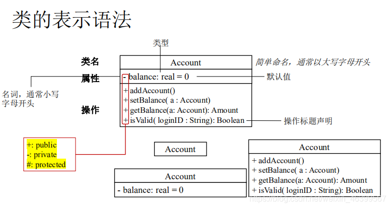
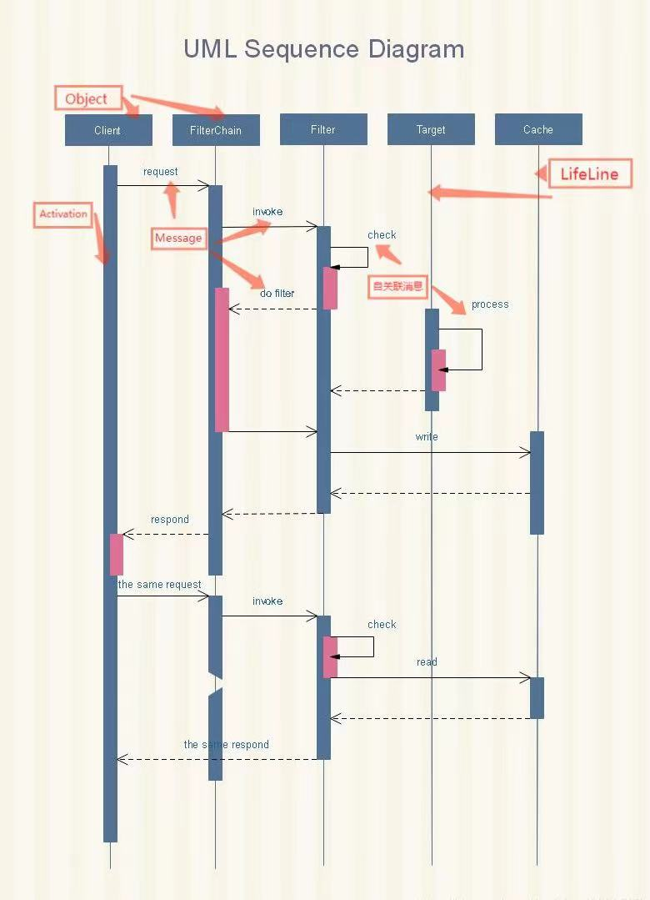
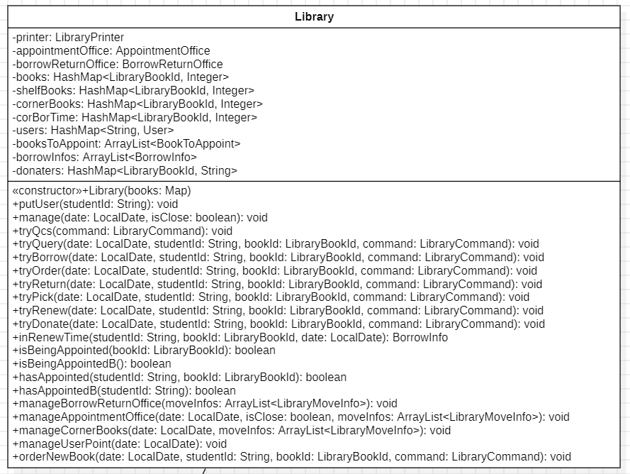

## 【BUAA-OO】M4：小型图书馆与UML建模

##  题目概述

本次作业需要我们实现一个小型图书馆系统，包括借书、预约、取书、捐书、计算信誉分等功能。同时，本次单元重在训练我们先进行建模与架构-再写代码的能力，需要我们利用star UML软件完成类图、状态图、顺序图。

## 正向建模与开发基础知识

在面向对象编程中，正向建模与开发是指从需求分析到系统实现的一种开发方法。它强调**从问题域的角度出发**，通过建立模型来描述系统的结构、行为和关系，并将这些模型转化为可执行的代码。（这段话总感觉和没说一样）总之，在落笔写代码细节前，我们需要宏观地进行类的设计：

- 有多少个需要的类
- 每个类大概要有什么方法（返回值，参数待定）
- 类与类之间的协作关系是什么

类的设计往往不能一次到位，一边写代码可能类的设计也要一边改变。但是startUML实在是用的不爽（）所以我最后索性直接在纸上画架构，这样方便添加也方便删去。

### 类图

UML类图中表示可见性的符号有3种：
+ ：表示public
- ：表示private

- #：表示protected

- ~：表示friendly

属性（Attibute）的表示方法：

-  可见性 名称：类型[= 缺省值]，其中[ ]内内容可省略
    例如：- balance:real[= 0]

操作（Operations）的表示方法：

- 可见性 名称(参数列表) [:返回类型]
      +addAcount(a: Acount)[:void]

UML 中的类图有以下几种关系：**依赖关系、关联关系、聚合关系、组合关系、泛化关系和实现关系**。其中**泛化**和**实现**的耦合度相等，它们是最强的。

>  泛化关系是一种继承关系，表示一般与特殊的关系，它指定了子类如何特化父类的所有特征和行为。例如：老虎是动物的一种，即有老虎的特性也有动物的共性。

### 状态图

状态图(Statechart Diagram)是描述一个实体基于事件反应的动态行为，显示了该实体如何根据当前所处的状态对不同的事件做出反应。画起来有点像计组里的有限状态机，一个方形表示一种状态，状态和状态之间用箭头连接。

### 顺序图/时序图

乍一看很像我在unit2给自己画的时序图hhh，但没想到不像电梯单元那样严格按时间顺序运行的程序也能画时序图。

**生命线(LifeLine)**
时序图中每个对象和底部中心都有一条垂直的虚线，这就是对象的生命线(对象的时间线)。以一条垂直的虚线表示。

**消息(Message)**
表现代表对象之间发送的信息。消息分为三种类型。

**同步消息(Synchronous Message)**
消息的发送者把控制传递给消息的接收者，然后停止活动，等待消息的接收者放弃或者返回控制。用来表示同步的意义。以一条实线+实心箭头表示。

**异步消息(Asynchronous Message)**
消息发送者通过消息把信号传递给消息的接收者，然后继续自己的活动，不等待接受者返回消息或者控制。异步消息的接收者和发送者是并发工作的。以一条实线+大于号表示。

**返回消息(Return Message)**
返回消息表示从过程调用返回。以小于号+虚线表示。

**自关联消息**
表示方法的自身调用或者一个对象内的一个方法调用另外一个方法。以一个半闭合的长方形+下方实心剪头表示。

## 本单元我的架构设计

因为有助教石睿知大神写好的library输入输出解析，这一单元的代码写得顺手了很多。感谢大神！！

由此也可以学到一个道理：**把输入输出解析从所有代码中单拎出来**。

总架构设计以Library类为主要功能类：

其中包含了try各种功能的方法。事实上，我感觉这样的设计会让library类太长了、、但是确实时间紧任务重，再加上预约处、借还处等各个类需要共享的信息还挺多的，所以也没有改这样的架构。

其它类包含预约处AppointmentOffice、借还处、用户这些自己能持书的主体。图书馆系统其实就是书本在不同类之间流动的过程管理。

最终的代码设计其实与我在纸上画的草稿追踪关系或许会更强一些hhh 但是确实有被如此丰富的UML模型震撼到，之前三个单元一直以为UML就是类图的代称。

## 四个单元中架构设计思维的演进

第一单元的表达式解析中，一开始几乎是完全按照第一次上机给出的递归下降逻辑写的代码，后来则是按照当时同学们在讨论区给出的Poly与Mono架构进行的设计，其实并没有做什么严格意义上架构设计的思考。（毕竟能写出来就万事大吉了orzzz）

第二单元是我架构设计思维进步最大的一个单元。当时翻了好多学长学姐的博客，学习生产者-消费者模式、电梯调度策略设计、影子电梯分配策略……从大的架构到小的架构基本都翻新过一次。

第三单元并没有什么架构设计思维的提升，毕竟架构都已经写好了，只需要按照JML好好写，同时思考怎么避免TLE就行。

第四单元中，我采用了比较摆烂的方法，把所用功能都堆在了Library类里，所以架构设计思维可能只得到了一点点点提升。

话虽然这么说，再回看我oopre超500行的main方法，仍然能感受到这个学期oo带给我架构设计思维的巨大进步hhh

## 测试思维的演进

大概就是，从测试小白变成了会捏一点数据的测试小白。

一开始的时候确实不太知道该怎么测试，大概只会把样例检测一下。但是经过第一、二单元腥风血雨的强测和互测之后，在向同学的请教中渐渐学会了怎么构造一些很难想象的边界数据。印象最深的就是第二单元第二次作业的超级TLE数据：reset5部电梯，同时来了一大堆乘客需求，犹记得当时我的代码可以跑出220s之长时间……也算是学到了，还能有这种构造法。

oo全程的测试真的万分感谢dpooj的搭建同学们以及慷慨分享评测机的同学/鞠躬/。dpooj里不知道有多少我程序跑出来的错误，wrongdata已经下载到了几百条。同学们搭建的开源评测机真的使我中测本就不宽裕的时间节约了很多。感恩！/再次鞠躬/

## 课程收获

第一单元第一次作业的时候，我直到周四都没想明白要写什么，参考着学长的github胡乱开始写代码，最后熬了两天压线通过了中测。当时真觉得自己学不会这门课，问了助教老师能不能去参加补弱。助教鼓励我说，万事开头难，之后就不会有这么困难的感觉了。然而，在oo的前三个单元中，我总是能感受到这种困难的压迫感。

每个单元的第二次作业对于我来说都像一场劫难，而我要在倒塌的立柱与呛鼻的浓烟之中找一条生路。第一单元第二次作业，因为不会写Poly和Mono，我和舍友在宿舍楼梯间找大佬答疑，连续几天在新主楼、五教写到凌晨一点，再回宿舍继续写。第二单元第二次作业，因为搞不懂”影子电梯“的调度策略，看了十几篇学长学姐的博客却很难找到解释；因为无论多努力写出来的代码总会在互测中被hack而感到崩溃，一边难受还是要一边debug。第三单元第二次作业，想要避免多重循环解决manageValue的问题，结果评测机一跑有三分之一都是输出错误，debug到凌晨五点也没找出来，最后压线交的中测。

现在回忆起来，一边觉得”轻舟已过万重山“，一边觉得”同志仍需努力“。写代码的时候常常感慨，自己为什么和那些写得好的同学差距那么大，他们好像很轻松就把每一单元的内容都完成得很好。这也是我来6系之后经常有的一种感受。好在我也会一直在往前走，现在的我已经不是当年那个mainClass超500行的小女孩了(x)毕竟这个世界除了天才们，还是需要一些我这样的普通人的。

学oo或许还有一个额外收获：我更懂得享受生活了。每个月一次的博客周简直就是天赐的幸福！！